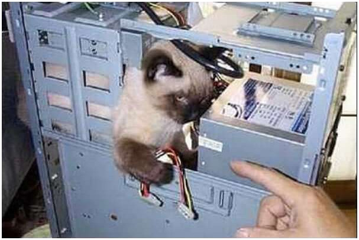

# <!-- fit --> Simple **TCP Chat**
# <!-- fit --> with simple **Native Client**

---


# **Who am I?**

## Antonio Gelameris

### `@TonioGela`

#### :writing_hand: toniogela.dev

---

Go to `github.com/TonioGela/fs2-chat` and download 

the chat client to star at the end of the presentation

---

# **Myths to debunk**

* Scala is a JVM only language
* There are no libraries (or few) for Scala Native or Scala.js
* Native and JS libraries are more difficult to use

---


# **Typelevel** ecosystem

Same APIs and behaviours* in all the three platforms that Scala supports

---

# **Other Myths to debunk**

* You can't do low level programming in Scala
* You can't do low level programming in pure FP style

---


# +

---


We'll be writing
- A chat *server* on JVM
- A chat **client** on Native

Communicating with a <b>shared cross-compiled binary protocol</b> over TCP

---

# <!-- fit --> *Sharing* the protocol using *sbt-crossproject*

```scala
// project/plugins.sbt
addSbtPlugin("org.scala-native"   % "sbt-scala-native"              % "0.4.15")
addSbtPlugin("org.portable-scala" % "sbt-scala-native-crossproject" % "1.3.2")

// build.sbt
ThisBuild / scalaVersion := "3.3.1"

lazy val root = project.in(file("."))
  .aggregate(protocol.native, protocol.jvm, server, client)

lazy val protocol = crossProject(JVMPlatform, NativePlatform)
  .in(file("protocol"))
  .settings(
    libraryDependencies ++= List(
      "co.fs2"       %%% "fs2-io"         % "3.10-4b5f50b",
      "co.fs2"       %%% "fs2-scodec"     % "3.10-4b5f50b"
    )
  )

lazy val server = project.in(file("server"))
  .dependsOn(protocol.jvm)
  .settings(name := "fs2-chat-server")

lazy val client = project.in(file("client"))
  .enablePlugins(ScalaNativePlugin)
  .dependsOn(protocol.native)
  .settings(
    name := "fs2-chat-client",
    libraryDependencies += "com.monovore" %%% "decline-effect" % "2.4.1"
  )
```

---

# Writing the **Protocol** with scodec

`scodec` is a suite of Scala libraries for working with binary data

```scala
val x: ByteVector = hex"deadbeef"      // ByteVector(4 bytes, 0xdeadbeef)
val y: BitVector = bin"00110110100"    // BitVector(11 bits, 0x368)
val z: BitVector = x.bits              // BitVector(32 bits, 0xdeadbeef)
val a: ByteVector = y.bytes            // ByteVector(2 bytes, 0x3680)
val b: Array[Byte] = x.toArray         // Array[Byte](-34, -83, -66, -17)
val c: ByteVector = ByteVector.view(b) // ByteVector(4 bytes, 0xdeadbeef)
```

```scala
case class DecodeResult[A](value: A, remainder: BitVector) { ... }

trait Decoder[+A]:
  def decode(b: BitVector): Attempt[DecodeResult[A]]

trait Encoder[-A]:
  def encode(a: A): Attempt[BitVector]

trait Codec[A] extends Encoder[A] with Decoder[A]
```

---

### *Predefined* codecs

```scala
val name: String = "Leia"

val encoded: Attempt[BitVector] = utf8_32.encode(name) 
// Successful(BitVector(64 bits, 0x000000044c656961))

val decoded = utf8_32.decode(hex"000000044c656961".bits)
// Successful(DecodeResult(Leia,BitVector(empty)))
```

It offers a number of pre-defined codecs for common datatypes and some combinators

### *Combinators*

```scala
case class Identity(name: String, surname: String, age: Int)

val codec: Codec[Identity] = (utf8_32 :: utf8_32 :: int8).as[Identity]

codec.encode(Identity("Luke", "Skywalker", 24))
// Successful(BitVector(176 bits, 0x000000044c756b6500000009536b7977616c6b657218))

codec.decode(hex"0x000000044c756b6500000009536b7977616c6b657218".bits)
// Successful(DecodeResult(Identity(Luke,Skywalker,24),BitVector(empty)))
```

---

# Messaging **Protocol** for our Chat

```scala
object Protocol:

  enum ClientCommand:
    case RequestUsername(name: String)
    case SendMessage(value: String)

  enum ServerCommand:
    case SetUsername(name: String)
    case Alert(text: String)
    case Message(name: String, text: String)
```

---

# Messaging **Protocol** for our Chat

```scala
object Protocol:

  enum ClientCommand:
    case RequestUsername(name: String)
    case SendMessage(value: String)

  object ClientCommand:
    given Codec[ClientCommand] = 
      discriminated[ClientCommand].by(uint8)
        .typecase(1, utf8_32.as[RequestUsername])
        .typecase(2, utf8_32.as[SendMessage])

  enum ServerCommand:
    case SetUsername(name: String)
    case Alert(text: String)
    case Message(name: String, text: String)

  object ServerCommand:
    given Codec[ServerCommand] = 
      discriminated[ServerCommand].by(uint8)
        .typecase(1, utf8_32.as[SetUsername])
        .typecase(2, utf8_32.as[Alert])
        .typecase(3, (utf8_32 :: utf8_32).as[Message])
```

---

# Messaging **Protocol** for our Chat

```scala
object Protocol:

  enum ClientCommand derives Codec:
    case RequestUsername(name: String)
    case SendMessage(value: String)

  enum ServerCommand derives Codec:
    case SetUsername(name: String)
    case Alert(text: String)
    case Message(name: String, text: String)
```

---

### `scodec` + `fs2` == `fs2-scodec`

```scala
val decoding: Stream[IO, Byte] => Stream[IO, In] =
  StreamDecoder.many(Decoder[In]).toPipeByte[IO]

val encoding: Stream[IO, Out] => Stream[IO, Byte] =
  StreamEncoder.many(Encoder[Out]).toPipeByte[IO]
```

---

### Creating a `MessageSocket` with `fs2-scodec`

```scala
trait MessageSocket[In, Out]:
  def read: Stream[IO, In]
  def write(out: Out): IO[Unit]

object MessageSocket:

  def apply[In: Decoder, Out: Encoder](
      socket: Socket[IO]
  ): IO[MessageSocket[In, Out]] = 
    Queue.bounded[IO, Out](1024).map: outgoingQueue =>
      new MessageSocket[In, Out] {

        def read: Stream[IO, In]      =
          val readSocket: Stream[IO, In] = socket.reads
            .through(StreamDecoder.many(Decoder[In]).toPipeByte[IO])

          val writeOutput = Stream
            .fromQueueUnterminated(outgoingQueue)
            .through(StreamEncoder.many(Encoder[Out]).toPipeByte[IO])
            .through(socket.writes)

          readSocket.concurrently(writeOutput)

        def write(out: Out): IO[Unit] = outgoingQueue.offer(out)
      }
```

---

# **Recap**: we have our building blocks

```scala
object MessageSocket:

  private def apply[In: Decoder, Out: Encoder](
      socket: Socket[IO]
    ): IO[MessageSocket[In, Out]] = { /*...*/ }

  type Client = MessageSocket[Protocol.ClientCommand, Protocol.ServerCommand]

  def client(socket: Socket[IO]): IO[Client] =
    apply[Protocol.ClientCommand, Protocol.ServerCommand](socket)

  type Server = MessageSocket[Protocol.ServerCommand, Protocol.ClientCommand]

  def server(socket: Socket[IO]): IO[Server] =
    apply[Protocol.ServerCommand, Protocol.ClientCommand](socket)
```

In the server and client we'll use just the `MessageSocket` interface and all the message types in `Protocol`

---

# Creating the chat **server** with `fs2-io`



---

# Server needs some **State**

```scala
final case class State private (ref: Ref[IO, Map[String, Client]]):
  def get(username: String): IO[Option[Client]]            = ref.get.map(_.get(username))
  def names: IO[List[String]]                              = ref.get.map(_.keySet.toList)
  def register(username: String, client: Client): IO[Unit] = ref.update(_ + (username -> client))
  def unregister(name: String): IO[Unit]                   = ref.update(_ - name)
  private def all: IO[List[Client]]                        = ref.get.map(_.values.toList)
  def broadcast(cmd: ServerCommand): IO[Unit]              = all.flatMap(_.traverse_(_.write(cmd)))

object State:
  def create: IO[State] = Ref.of[IO, Map[String, Client]](Map.empty).map(new State(_))
```

*before registering it, a `Client` has to send us a `RequestUsername` message

---

### Creating a `Stream` of *TCP sockets*

```scala
import fs2.io.net.{Network, Socket}

val socketStream: Stream[IO, Socket[IO]] = Network[IO].server(port = port"5555".some)
```

\*each time a clients connects, a new `Socket[IO]` will flow into the stream


```scala
def apply[In: Decoder, Out: Encoder](socket: Socket[IO]): IO[MessageSocket[In, Out]]
```

```scala
val socketStream: Stream[IO, Socket[IO]] = Network[IO].server(port = port"5555".some)

// Stream[IO, A].evalMap(A => IO[B]): Stream[IO, B]
socketStream.evalMap(MessageSocket.client): Stream[IO, Client]
```

\*Now each time a client connects we will get a new `Client` in the stream

---

```scala
def handleClient(state: State)(client: Client): Stream[IO, Unit]
```

Let's assume that each `Client` handling results in a `Stream[IO, Unit]`

```scala
Network[IO].server(port = port"5555".some) // Stream[IO, Socket[IO]]
  .evalMap(MessageSocket.client)           // Stream[IO, Client]
  .map(handleClient(initialState))         // Stream[IO, Stream[IO, Unit]]
  .parJoinUnbounded                        // Stream[IO, Unit]
```

We can handle multiple `Clients` in **parallel** using `map` + `parJoin`

It's time to implement the `Client` handling!


---

### **Stateless approach**

```scala
  def handleClient(state: State)(client: Client): Stream[IO, Unit] = client.read.evalMap {

    case ClientCommand.RequestUsername(name) => 
      state.register(name, client) >>
      client.write(ServerCommand.SetUsername(name)) >>
      state.broadcast(ServerCommand.Alert(s"$name connected"))

    case ClientCommand.SendMessage("/users") =>
      state.names.map(_.mkString(", ")).map(ServerCommand.Alert(_)).flatMap(client.write)

    case ClientCommand.SendMessage(message)  =>
      state.broadcast(ServerCommand.Message("😱", message))
  }
  .onFinalize(
    state.unregister("😱") >> state.broadcast(ServerCommand.Alert(s"😱 disconnected"))
  )
```

\*We should first **wait** for the first `RequestUsername` message!

---

### **Stateful approach**

Let's suppose we **already received** a `RequestUsername`:

```scala
  def handleMessages(
      name: String,
      state: State,
      send: ServerCommand => IO[Unit],
      messages: Stream[IO, ClientCommand]
  ): Stream[IO, Unit] = messages.evalMap {

    case ClientCommand.RequestUsername(_)    =>
      IO.println(s"$name client tried to Request another username!")

    case ClientCommand.SendMessage("/users") =>
      state.names.map(_.mkString(", ")).map(ServerCommand.Alert(_)).flatMap(send)
      
    case ClientCommand.SendMessage(message)  => 
      state.broadcast(ServerCommand.Message(name, message))
  }
  .onFinalize(
    state.unregister(name) >> state.broadcast(ServerCommand.Alert(s"$name disconnected"))
  )
```

---

:point_down:`RequestUsername` handling

```scala
def registerAndGreet(name: String, client: Client, state: State): IO[Unit] =
  state.register(name, client) >>
  client.write(ServerCommand.SetUsername(name)) >>
  state.broadcast(ServerCommand.Alert(s"$name connected"))
```

:point_down:`Client` handling

```scala
def handleClient(state: State)(client: Client): Stream[IO, Unit] = {

  def waitForUsername(s: Stream[IO, ClientCommand]): Pull[IO, Unit, Unit] =
    s.pull.uncons1.flatMap {
      case Some((ClientCommand.RequestUsername(name), restOfTheCommands)) =>
        Pull.eval(registerAndGreet(name, client, state)) >>
        handleMessages(name, state, client.write, restOfTheCommands).pull.echo

      case Some((_, rest)) => waitForUsername(rest) // recursion!

      case None => Pull.done
    }

  waitForUsername(client.read).stream
}
```

`Pull[IO, Unit, Option[(ClientCommand, Stream[IO, ClientCommand])]]`

<!-- With Stream it's easy to encode "do this for each emitted value" -->

<!-- With Pull it's easier to keep iterating -->

---

```scala
object Server extends IOApp.Simple:
  def run: IO[Unit] =
    for
      state       <- State.create
      socketStream = Network[IO].server(port = port"5555".some)
      _           <- start(socketStream, state).compile.drain
    yield ()

  def start(stream: Stream[IO, Socket[IO]], state: State) =
    stream
      .evalMap(MessageSocket.client)
      .map(handleClient(state))
      .parJoinUnbounded
```

Then we *dockerize it*, *deploy it* and *profit it*

---

# Creating the chat **client** with `fs2-io`


## with  **Scala native**!

---

## App's **Entrypoint**

```scala
val username: Opts[String] = Opts.argument[String]("username")

object ClientApp extends CommandIOApp("fs2chat-client", "Fs2 powered TCP chat client"):
  def main = username.map: username =>
    Network[IO].client(SocketAddress(ip"0.0.0.0", port"5555")).use(socket =>
      for
        printer <- Printer.create
        server  <- MessageSocket.server(socket)
        _       <- Client.connectAndHandle(server, username, printer).compile.drain
      yield ExitCode.Success
    )
```

---

```scala
def connectAndHandle(
    server: Server,
    desiredUsername: String,
    printer: Printer
): Stream[IO, Unit] = 
  Stream.eval(server.write(ClientCommand.RequestUsername(desiredUsername))) >>
    processIncoming(server, printer).concurrently(processOutgoing(server, printer))

def processIncoming(server: Server, printer: Printer): Stream[IO, Unit] = server
  .read
  .evalMap:
    case ServerCommand.SetUsername(username)  => printer.alert("Assigned username: " + username)
    case ServerCommand.Alert(txt)             => printer.alert(txt)
    case ServerCommand.Message(username, txt) => printer.println(s"$username> $txt")

def processOutgoing(server: Server, printer: Printer): Stream[IO, Unit] = Stream
  .repeatEval(printer.readLine)
  .unNone
  .map(ClientCommand.SendMessage(_))
  .evalMap(server.write)
```

```scala
def readLine: IO[Option[String]] =
  stdinUtf8[IO](1024).take(1).compile.foldMonoid.map(_.trim.some.filterNot(_.isBlank))
```

\*`printer.readLine` should be implemented in a **non blocking** way

---

# <!-- fit --> **Demo Time**

---

<style> li { list-style: none; } </style>

## <!-- fit --> How can we do *I/O* with just *one thread*?

* # **Epoll**!

---

### Cats Effect native runtime uses **epoll** / **kqueue**

`epoll` is an "*I/O event notification facility*" 

Imagine it as a in-kernel data structure where you can add **file descriptors**

Linux is a *file based* operating system

open sockets, stdin/out/err and almost anything else are files/file descriptors

`epoll` **monitors multiple file descriptors** to see if I/O is possible on any of them

<!-- More info: https://man7.org/linux/man-pages/man7/epoll.7.html -->

<!-- concurrency is waiting in parallel -->

---

We add *stdin* and the *open socket* file descriptors to epoll then we apply the following 

*event loop algorithm*:

```
1) if you have tasks, you perform them

2) if you don’t have tasks, you block until the next timer

3) If you don’t have timers either, you just block
```

`epoll_wait` returns the control back to the caller once one of the file descriptors it's handling is *"ready" for I/O*

<!-- in 2 you call epoll_wait with a timeout -->

<!-- you wait using epoll_wait ofc -->

---

# <!-- fit --> I am using Cats Effect/fs2/Http4s **on the JVM**, should I care?

* Yes, as the Cats Effect JVM flavour will feature a configurable polling system. One of the implementations `fs2-io_uring` performed 340% better than the NIO2 based one while benchmarking an Ember server.

---

# *Possible rough future plans**


\*the source is Arman

---

# <!-- fit --> Thanks for the attention!

Special thanks to **Michael Pilquist** and **Arman Bilge**